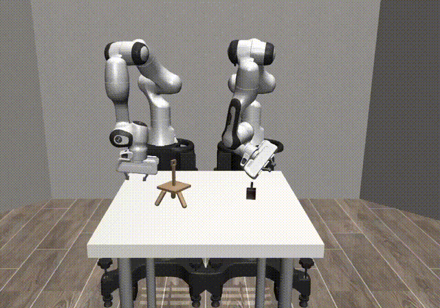

# DexMimicGen Tutorial

<p align="center">
  
</p>

## Requirements
This work was tested on Ubuntu 24.04, Python 3.12, Cuda 12.8 and Nvidia RTX 4070, Robosuite xx, Dexmimicgen xx.

## Installation
Clone the repo and create a virtual environment:
```
git clone https://github.com/ShalikAI/dexmimicgen-tutorial
cd dexmimicgen-tutorial
python3 -m venv dexmimic_venv
source dexmimic_venv/bin/activate
pip3 install --upgrade pip
```

Install the latest [robosuite](https://github.com/ARISE-Initiative/robosuite) first:

```bash
git clone https://github.com/ARISE-Initiative/robosuite
cd robosutie
pip install -e .
```

Now install dexmimicgen module:

```bash
cd ..
pip install -e .
```

After installation, you can run the following command to test the environments.

```bash
python scripts/demo_random_action.py --env TwoArmThreading --render
```

<div align="center">
  
</div>

Note: If you are on a headless machine, you can run without the `--render` flag.

## Environments

For detailed information about the environments, please refer to [environments.md](environments.md).

## Datasets

You can download the datasets from [HuggingFace](https://huggingface.co/datasets/MimicGen/dexmimicgen_datasets/tree/main).

You can also run the script to download the datasets.

```bash
python scripts/download_hf_dataset.py --path /path/to/save/datasets
```

By default, the datasets will be saved to `./datasets/generated`. There will be in total 9 datasets of 60 GB.
```
two_arm_box_cleanup.hdf5
two_arm_can_sort_random.hdf5
two_arm_coffee.hdf5
two_arm_drawer_cleanup.hdf5
two_arm_lift_tray.hdf5
two_arm_pouring.hdf5
two_arm_threading.hdf5
two_arm_three_piece_assembly.hdf5
two_arm_transport.hdf5
```

And then, you can playback one demo in the dataset by running:

```bash
python scripts/playback_datasets.py --dataset datasets/generated/two_arm_can_sort_random.hdf5 --n 10
```

<div align="center">
  
</div>

Inspect 1 episode in detail:
```
python - <<'PY'
import h5py

f = h5py.File("datasets/generated/two_arm_can_sort_random.hdf5", "r")
ep = list(f["data"].keys())[0]
print("Episode:", ep)

grp = f["data"][ep]
print("\nDatasets:")
for k in grp.keys():
    print(" ", k)

print("\nAttributes:")
for k, v in grp.attrs.items():
    print(" ", k, type(v))

f.close()
PY
```
Here is the output:
```
Datasets:
  action_dict
  actions
  datagen_info
  obs
  states

Attributes:
  model_file <class 'str'>
  num_samples <class 'numpy.int64'>
```

Inspect `obs` (observation) space:
```
python - <<'PY'
import h5py
f = h5py.File("datasets/generated/two_arm_can_sort_random.hdf5", "r")
ep = "demo_0"
obs = f[f"data/{ep}/obs"]
print("obs keys:")
for k in obs.keys():
    print(" ", k, obs[k].shape, obs[k].dtype)
f.close()
PY
```
Here is the output:
```
obs keys:
  frontview_image (276, 84, 84, 3) uint8
  robot0_base_pos (276, 3) float64
  robot0_base_quat (276, 4) float32
  robot0_base_to_left_eef_pos (276, 3) float64
  robot0_base_to_left_eef_quat (276, 4) float32
  robot0_base_to_left_eef_quat_site (276, 4) float32
  robot0_base_to_right_eef_pos (276, 3) float64
  robot0_base_to_right_eef_quat (276, 4) float32
  robot0_base_to_right_eef_quat_site (276, 4) float32
  robot0_eye_in_left_hand_image (276, 84, 84, 3) uint8
  robot0_eye_in_right_hand_image (276, 84, 84, 3) uint8
  robot0_joint_pos (276, 14) float64
  robot0_joint_pos_cos (276, 14) float64
  robot0_joint_pos_sin (276, 14) float64
  robot0_joint_vel (276, 14) float64
  robot0_left_eef_pos (276, 3) float64
  robot0_left_eef_quat (276, 4) float64
  robot0_left_eef_quat_site (276, 4) float32
  robot0_left_gripper_qpos (276, 11) float64
  robot0_left_gripper_qvel (276, 11) float64
  robot0_right_eef_pos (276, 3) float64
  robot0_right_eef_quat (276, 4) float64
  robot0_right_eef_quat_site (276, 4) float32
  robot0_right_gripper_qpos (276, 11) float64
  robot0_right_gripper_qvel (276, 11) float64
```
Inspect `state` and `action` space:
```
python - <<'PY'
import h5py, numpy as np
f = h5py.File("datasets/generated/two_arm_can_sort_random.hdf5", "r")
ep = "demo_0"
grp = f["data"][ep]
print("states:", grp["states"].shape, grp["states"].dtype)
print("actions:", grp["actions"].shape, grp["actions"].dtype)
f.close()
PY
```
Here is the output:
```
states: (226, 103) float64
actions: (226, 24) float64
```
Inspect `action_dict` and `datagen_info`:
```
python - <<'PY'
import h5py

def print_tree(g, prefix=""):
    for k, obj in g.items():
        if isinstance(obj, h5py.Dataset):
            print(f"{prefix}{k} {obj.shape} {obj.dtype}")
        elif isinstance(obj, h5py.Group):
            print(f"{prefix}{k}/ (group)")
            print_tree(obj, prefix=prefix + k + "/")

with h5py.File("datasets/generated/two_arm_can_sort_random.hdf5", "r") as f:
    ep = "demo_0"
    grp = f[f"data/{ep}"]  # <-- open episode group once

    for name in ["action_dict", "datagen_info"]:
        print(f"\n{name} keys:")

        # ---- HOOK: skip cleanly if missing ----
        if name not in grp:
            print("  (missing)")
            continue
        # --------------------------------------

        print_tree(grp[name], prefix="  ")
PY
```

Here is one type of output:
```
action_dict keys:
  left_abs_pos (276, 3) float32
  left_abs_rot_6d (276, 6) float32
  left_abs_rot_axis_angle (276, 3) float32
  left_gripper (276, 6) float32
  right_abs_pos (276, 3) float32
  right_abs_rot_6d (276, 6) float32
  right_abs_rot_axis_angle (276, 3) float32
  right_gripper (276, 6) float32

datagen_info keys:
  (missing)
```

Here is another type of output (for two_arm_box_cleanup.hdf5):
```
action_dict keys:
  left_gripper (226, 6) float32
  left_rel_pos (226, 3) float32
  left_rel_rot_6d (226, 6) float32
  left_rel_rot_axis_angle (226, 3) float32
  right_gripper (226, 6) float32
  right_rel_pos (226, 3) float32
  right_rel_rot_6d (226, 6) float32
  right_rel_rot_axis_angle (226, 3) float32

datagen_info keys:
  eef_pose (226, 2, 4, 4) float64
  gripper_action (226, 2, 6) float64
  object_poses/ (group)
  object_poses/box (226, 4, 4) float64
  object_poses/lid (226, 4, 4) float64
  subtask_term_signals/ (group)
  subtask_term_signals/lid_off_ground (226,) int64
  target_pose (226, 2, 4, 4) float64
```

## Launch Training with robomimic

We provide config and training code to reproduce the BC-RNN result in our paper.

First, you need to install robomimic

```bash

git clone https://github.com/ARISE-Initiative/robomimic.git -b dexmimicgen
cd robomimic
pip install -e .
```

Then you need to generate the config file for the training.

```bash
cd dexmimicgen
python scripts/generate_training_config.py --dataset_dir /path/to/datasets --config_dir /path/to/save/config --output_dir /path/to/save/output
```

By default, it will try to find the datasets in `./datasets`, and save the config and output in `./datasets/train_configs/bcrnn_action_dict` and `./datasets/train_results/bcrnn_action_dict` respectively.

After that, you can run the training script.

```bash
cd robomimic
python scripts/train.py --config /path/to/config
```
